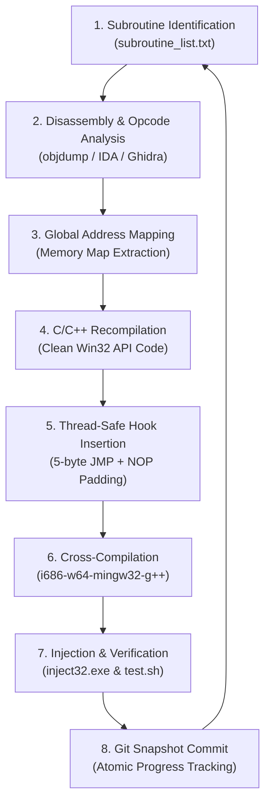

# Binary Recompilation & Hot-Patching Pipeline Guide

Comprehensive technical reference for reverse engineering, statically recompiling, hot-patching, and verifying subroutines from legacy PE32/PE64 binaries into native C/C++ DLL modules.

---

## 1. Overview & Architectural Goals

The goal of this pipeline is **incremental binary recompilation**: systematically replacing legacy compiled x86 machine code routines inside a running executable (`WINMINE.EXE`) with modern, readable, native C/C++ implementations while maintaining 100% binary compatibility and zero runtime regressions.

### Key Architectural Invariants
1. **Direct Memory Mapping**: Recompiled code accesses the exact global data structures in the target binary's `.data` and `.bss` sections.
2. **Calling Convention Fidelity**: All functions preserve exact calling conventions (`__stdcall`, `__cdecl`, `__fastcall`, `__thiscall`) and stack cleanup responsibilities.
3. **Thread Safety**: Binary hot-patching enforces an atomic **Freeze $\to$ Patch $\to$ Unfreeze** lifecycle to prevent thread race conditions.
4. **Autonomous Testing**: Every newly recompiled function is tested live in an emulated/virtualized environment with headless GUI event dispatching.

---

## 2. End-to-End Workflow Diagram



---

## 3. Detailed Step-by-Step Methodology

### Step 1: Subroutine Selection & Opcode Analysis

For each routine in `subroutine_list.txt`:
1. **Identify Entry Address**: Determine virtual address (e.g. `0x01002825`).
2. **Disassemble Function Header**:
   ```bash
   objdump -d --start-address=0x01002825 --stop-address=0x010028B8 WINMINE.EXE
   ```
3. **Check Instruction Boundaries**:
   - A 32-bit relative near jump `JMP rel32` (`0xE9 xx xx xx xx`) requires **5 bytes**.
   - Inspect instructions starting at entry point to find the lowest byte boundary $\ge 5$ bytes.
   - Example:
     ```assembly
     01002825: 53                   push %ebx        (1 byte)
     01002826: 55                   push %ebp        (1 byte)
     01002827: 56                   push %esi        (1 byte)
     01002828: 8b 74 24 10          mov 0x10(%esp),%esi (4 bytes)
     ```
     Total instruction boundary = $1 + 1 + 1 + 4 = \mathbf{7\text{ bytes}}$.
     Hook layout: `0xE9 <rel32>` (5 bytes) + `0x90 0x90` (2 NOPs).

4. **Identify Calling Convention**:
   - Look at the return instruction:
     - `ret $0x4` / `ret $0x8` / `ret $0x10` $\to$ `__stdcall` (callee cleans $N$ bytes from stack).
     - `ret` (no operand) $\to$ `__cdecl` (caller cleans stack).
     - Uses `ECX` as first argument $\to$ `__thiscall` or `__fastcall`.

---

### Step 2: Global Memory & Data Structure Mapping

Map all external memory references to exact virtual addresses in `WINMINE.EXE`:

| Virtual Address | Type | Name / Purpose |
|---|---|---|
| `0x01005194` | `int` | `dword_1005194`: Remaining unflagged mine count |
| `0x0100579C` | `int` | `dword_100579C`: Elapsed game seconds timer |
| `0x01005160` | `int` | `dword_1005160`: Current face state (0=smile, 1=down, 2=scared, 3=dead, 4=shades) |
| `0x01005158` | `HGDIOBJ` | `dword_1005158`: Active GDI pen/brush handle |
| `0x01005B24` | `HWND` | `hWnd_1005B24`: Main window handle |
| `0x01005B2C` | `int` | `xRight_1005B2C`: Window client area width |
| `0x01005B20` | `int` | `yBottom_1005B20`: Window client area height |
| `0x0100595C` | `void*` | `dword_100595C`: `BITMAPINFO*` for 7-segment digit glyphs |
| `0x01005A60` | `uint32_t[]` | `dword_1005A60`: Bitstream byte offsets for digits 0-9, blank, minus |
| `0x01005A00` | `void*` | `dword_1005A00`: `BITMAPINFO*` for smiley face button icons |
| `0x01005960` | `uint32_t[]` | `dword_1005960`: Bitstream byte offsets for face icons |
| `0x01005A90` | `int` | `dword_1005A90`: Header bar right-side margin padding |
| `0x010050D0` | `const WCHAR*[]` | `lpKeyName_10050D0`: Registry value names table (`Height`, `Width`, etc.) |
| `0x01005950` | `HKEY` | `dword_1005950`: Open Registry key handle |

---

### Step 3: Recompilation in C/C++

Write the recompiled C/C++ implementation using standard Win32 APIs, replacing decompiler obfuscations with clean, readable code:

```cpp
/**
 * Recompiled sub_1002825: Render 3-digit elapsed game timer on DC
 */
DWORD __stdcall draw_number_sub_1002825(HDC hdc) {
    int v1 = dword_100579C;
    DWORD Layout = GetLayout(hdc);

    // Disable RTL layout mirroring if enabled
    if ((Layout & 1) != 0) {
        SetLayout(hdc, 0);
    }

    int v5 = v1 / 100;       // Hundreds digit
    int v3 = v1 % 100;       // Tens and ones

    log_msg("[sub_1002825] Rendering timer %d -> digits: [%d, %d, %d]\n",
            v1, v5, v3 / 10, v3 % 10);

    sub_1002752(hdc, xRight_1005B2C - dword_1005A90 - 56, v5);
    sub_1002752(hdc, xRight_1005B2C - dword_1005A90 - 43, v3 / 10);
    DWORD result = (DWORD)sub_1002752(hdc, xRight_1005B2C - dword_1005A90 - 30, v3 % 10);

    if ((Layout & 1) != 0) {
        return SetLayout(hdc, Layout);
    }
    return result;
}
```

---

### Step 4: Thread Freezing & Memory Patching Lifecycle

To prevent catastrophic crashes from executing partially-written 5-byte instruction detours, the hook installer implements the **Freeze $\to$ Patch $\to$ Unfreeze** protocol:

```cpp
void install_all_hooks() {
    // 1. Enumerate and suspend all other threads in the target process
    freeze_other_threads();

    // 2. Safely apply memory patches with page permission management
    install_jmp_hook((void*)ADDR_SUB_1002752, (void*)&sub_1002752, 9);
    install_jmp_hook((void*)ADDR_SUB_1002785, (void*)&sub_1002785, 7);
    install_jmp_hook((void*)ADDR_SUB_1002801, (void*)&sub_1002801, 7);
    install_jmp_hook((void*)ADDR_SUB_1002825, (void*)&draw_number_sub_1002825, 7);
    install_jmp_hook((void*)ADDR_SUB_10028B5, (void*)&redraw_number_sub_10028B5, 7);
    install_jmp_hook((void*)ADDR_SUB_10028D9, (void*)&sub_10028D9, 9);
    install_jmp_hook((void*)ADDR_SUB_1002913, (void*)&sub_1002913, 7);
    install_jmp_hook((void*)ADDR_SUB_100293D, (void*)&set_draw_mode_sub_100293D, 7);
    install_jmp_hook((void*)ADDR_SUB_1002971, (void*)&sub_1002971, 8);
    install_jmp_hook((void*)ADDR_SUB_1002A22, (void*)&sub_1002A22, 7);
    install_jmp_hook((void*)ADDR_SUB_1002AC3, (void*)&sub_1002AC3, 5);
    install_jmp_hook((void*)ADDR_SUB_1002AF0, (void*)&sub_1002AF0, 7);
    install_jmp_hook((void*)ADDR_SUB_1002B14, (void*)&sub_1002B14, 5);
    install_jmp_hook((void*)ADDR_SUB_1002B27, (void*)&sub_1002B27, 7);
    install_jmp_hook((void*)ADDR_SUB_100346A, (void*)&sub_100346A, 10);

    // 3. Resume all suspended threads
    unfreeze_other_threads();
}
```

#### Hook Sizing Calculation
$$\text{RelOffset} = \text{TargetAddress}_{\text{hook}} - (\text{TargetAddress}_{\text{orig}} + 5)$$

---

### Step 5: Compilation & DLL Injection

#### Build with MinGW Cross-Compiler
```bash
i686-w64-mingw32-g++ -shared -static -O2 -o winmine_hook.dll winmine_hook.cpp -lgdi32 -ladvapi32
```

#### Remote Thread Injection
```bash
wine inject32.exe WINMINE.EXE winmine_hook.dll
```
The injector performs:
1. `OpenProcess(PROCESS_ALL_ACCESS, FALSE, pid)`
2. `VirtualAllocEx(hProcess, NULL, dllPathLen, MEM_COMMIT, PAGE_READWRITE)`
3. `WriteProcessMemory(hProcess, remoteBuf, dllPath, dllPathLen, NULL)`
4. `GetProcAddress(GetModuleHandleA("kernel32.dll"), "LoadLibraryA")`
5. `CreateRemoteThread(hProcess, NULL, 0, (LPTHREAD_START_ROUTINE)pLoadLibrary, remoteBuf, 0, NULL)`

---

### Step 6: Testing & Verification Pipeline

#### Interactive Manual Testing
```bash
make run
# or
./run_winmine.sh
```
Launches `WINMINE.EXE` visibly on `$DISPLAY`, injects `winmine_hook.dll`, and streams real-time execution logs from `winmine_hook.log`.

#### Headless CI / Automated Regression Testing
```bash
make test
# or
./test.sh
```
Runs 6 automated tests under `Xvfb`:
- Tests 1-3: Injector input validation and error handling
- Tests 4-5: 64-bit multi-hook injection by process name and PID
- Test 6: 32-bit `WINMINE.EXE` end-to-end injection, window invalidation, mouse clicks, and recompiled hook execution trace verification

---

## 4. Current Recompilation Status

| Routine Name | Original VA | Subsystem | Status |
|---|---|---|---|
| `sub_1002752` | `0x01002752` | 7-Segment Glyph Renderer | **Recompiled & Hooked** |
| `sub_1002785` | `0x01002785` | Mine Counter Formatter | **Recompiled & Hooked** |
| `sub_1002801` | `0x01002801` | Mine Counter DC Wrapper | **Recompiled & Hooked** |
| `sub_1002825` | `0x01002825` | Timer Digits Formatter | **Recompiled & Hooked** |
| `sub_10028B5` | `0x010028B5` | Timer DC Wrapper | **Recompiled & Hooked** |
| `sub_10028D9` | `0x010028D9` | Smiley Face Icon Renderer | **Recompiled & Hooked** |
| `sub_1002913` | `0x01002913` | Smiley Face DC Wrapper | **Recompiled & Hooked** |
| `sub_100293D` | `0x0100293D` | GDI ROP2 / Brush Selector | **Recompiled & Hooked** |
| `sub_1002971` | `0x01002971` | 3D Bevel Rectangle Engine | **Recompiled & Hooked** |
| `sub_1002A22` | `0x01002A22` | Window Frames Layout Orchestrator | **Recompiled & Hooked** |
| `sub_1002AC3` | `0x01002AC3` | Master Repaint Dispatcher | **Recompiled & Hooked** |
| `sub_1002AF0` | `0x01002AF0` | Master Repaint DC Wrapper | **Recompiled & Hooked** |
| `sub_1002B14` | `0x01002B14` | Game Init & Reset Controller | **Recompiled & Hooked** |
| `sub_1002B27` | `0x01002B27` | Clamped Registry Setting Reader | **Recompiled & Hooked** |
| `sub_100346A` | `0x0100346A` | Mine Counter Delta Updater | **Recompiled & Hooked** |
